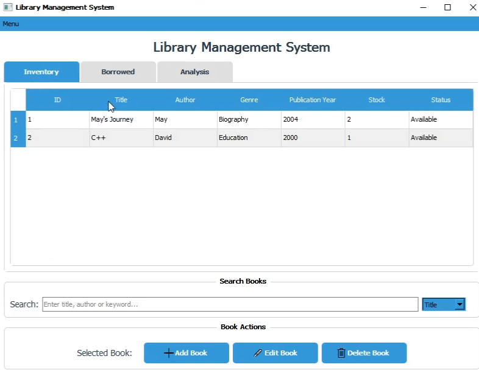
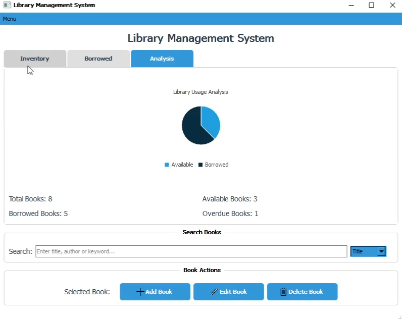
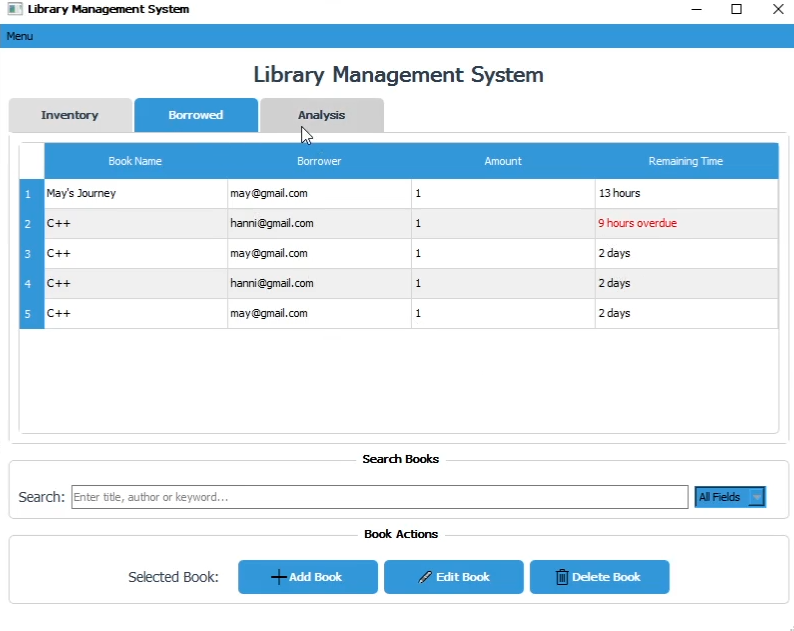

# 📚 SmartLib – Library Management System

SmartLib is a modern desktop library management system developed by **me and my teammate** using **C++**, **Qt Creator**, and **SQLite**. 
It streamlines the entire library workflow with a smooth user and admin interface with proper input validations and error handling.

### 👤 User Mode
- 📖 Borrow and return books easily
- 🔍 Search books by title, author, or genre
- 🧾 View personal dashboard with borrowed books and their remaining days before due date

### 🔐 Admin Mode
- 🗂️ Manage book inventory (add, update, remove)
- ⏰ Track overdue books
- 👥 Initial admin auto-created on first run

### 💡 Bonus Features
- 📌 Centralized statistics of books (total, available, borrowed, overdue)

## ⚙️ Tech Stack
- 🖥️ C++ with Qt Creator (GUI)
- 🗄️ SQLite (Database)
- 📦 Clean file structure with separation of user/admin logic

## 🖼️ Preview

---

---

